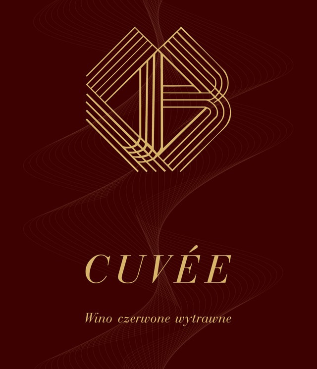

# Winnica Ruda — strona internetowa

Minimalistyczna, jednostronicowa strona wizytówkowa dla Winnicy Ruda (butikowej winnicy nad Jeziorem Ruda, gmina Rogowo).

## Struktura plików

```
winnica-ruda/
├── index.html            — treść i struktura strony
├── style.css              — wszystkie style
├── script.js               — animacje przy przewijaniu, nawigacja, mapa
├── assets/
│   ├── logo-mark.png            — logo (monogram) z przezroczystym tłem, użyte w nav/hero/stopce
│   ├── favicon-32.png           — favicon (karta przeglądarki)
│   ├── favicon-192.png          — favicon (Android/PWA)
│   ├── apple-touch-icon.png     — ikona dla iOS (dodanie do ekranu głównego)
│   └── label-cuvee.jpg          — zdjęcie prawdziwej etykiety wina Cuvée (z przesłanego PDF-a) — gotowe do wykorzystania np. w przyszłym sklepie
└── README.md              — ten plik
```

Strona nie wymaga żadnego budowania (bundlera, npm itd.) — to czysty HTML/CSS/JS. Jedyna zewnętrzna zależność to fonty Google (Fraunces + Inter), wczytywane z CDN.

## Jak podejrzeć stronę lokalnie

Wystarczy otworzyć plik `index.html` bezpośrednio w przeglądarce (dwuklik) — albo, jeśli wolisz działać z lokalnego serwera:

```bash
cd winnica-ruda
python3 -m http.server 8000
```

i wejść na `http://localhost:8000`.

## Jak wystawić stronę za darmo (GitHub Pages)

1. Utwórz nowe repozytorium na GitHubie i wrzuć do niego **całą zawartość** tego folderu (łącznie z folderem `assets/` — bez niego zniknie logo i favicony).
2. Wejdź w **Settings → Pages**.
3. W sekcji "Build and deployment" wybierz branch `main` i folder `/ (root)`.
4. Zapisz — po chwili strona będzie dostępna pod adresem `https://twoja-nazwa.github.io/nazwa-repozytorium/`.

Skoro macie już własny hosting i domenę — możecie równie dobrze po prostu wgrać te same pliki (znów: z folderem `assets/`) przez FTP/panel hostingu, GitHub Pages nie jest wymagany.

## Sklep — status

Zgodnie z ustaleniami, sklep **nie jest budowany od zera w tym kodzie** — sprzedaż wina online wiąże się w Polsce z wymogami (weryfikacja wieku, przepisy dot. wyrobów winiarskich), więc sensowniej postawić go na gotowej platformie (np. **Shoper**, ewentualnie WooCommerce + Przelewy24/PayU).

W menu nawigacji jest już link "Sklep", ale na razie wskazuje na przykładowy adres:

```html
<a href="https://sklep.winnicaruda.pl">Sklep</a>
```

Gdy sklep na wybranej platformie będzie gotowy, podmieńcie ten link w pliku `index.html` (linia z komentarzem `TODO`) na docelowy adres — najczęściej będzie to subdomena (np. `sklep.winnicaruda.pl`) albo osobna zakładka w panelu Shopera. Zdjęcie prawdziwej etykiety Cuvée (`assets/label-cuvee.jpg`) możecie od razu wykorzystać jako zdjęcie produktu w sklepie.

## SEO — co zrobiliśmy i co zrobić dalej

**Już gotowe w kodzie:**
- `sitemap.xml` i `robots.txt` (w głównym folderze) — mapa strony dla wyszukiwarek.
- `assets/og-image.jpg` — obrazek podglądu przy udostępnianiu linku (Facebook, WhatsApp, itp.).
- Meta title/description, dane strukturalne JSON-LD (typ `Winery`, adres, telefon, e-mail, współrzędne), tagi Open Graph i Twitter Card.

**Do zrobienia samodzielnie (2 narzędzia Google, oba bezpłatne):**

### 1. Google Search Console — search.google.com/search-console
1. Dodaj właściwość dla `winnicaruda.pl`.
2. Zweryfikuj domenę (Google poprosi o dodanie rekordu TXT w ustawieniach DNS u Waszego dostawcy domeny, albo o wgranie pliku HTML — Search Console pokaże dokładną instrukcję).
3. W sekcji **Mapy witryn (Sitemaps)** wklej: `https://winnicaruda.pl/sitemap.xml` i wyślij.
4. Po zaindeksowaniu będziecie tam widzieć, na jakie frazy strona się pojawia i ile osób w nią klika.

### 2. Google Business Profile — business.google.com
To dla lokalnej widoczności (Mapy Google, wyniki typu "winnica w pobliżu", "winnica kujawsko-pomorskie") — dla winnicy odwiedzanej stacjonarnie to zwykle ważniejsze niż sama strona.
1. Załóż/zweryfikuj wizytówkę "Winnica Ruda" (kategoria: Winnica / Vineyard).
2. Uzupełnij adres, telefon, godziny, link do strony (`https://winnicaruda.pl`).
3. Dodaj zdjęcia (jak tylko będą gotowe — na razie stronę reprezentują etykiety win, patrz sekcja "Wina" niżej).
4. Zachęcajcie gości do zostawiania opinii — to jeden z mocniejszych sygnałów rankingowych dla lokalnych wyników.

### Inne rzeczy, które pomogą w SEO z czasem
- **Prawdziwe zdjęcia winnicy** (krajobraz, zbiory, degustacje) — obecnie tę rolę pełnią etykiety win; realne fotografie z miejsca to naturalny kolejny krok, gdy będziecie je mieć.
- **Linki z zewnątrz** — wpisy w katalogach winnic (np. mapa winnic w Polsce), strony turystyczne gminy Rogowo/powiatu rypińskiego, lokalna prasa — każdy taki link buduje wiarygodność domeny.
- **Świeża treść** — nawet prosta zakładka "Aktualności" z wpisami typu "ruszyły zbiory" raz na kilka tygodni działa lepiej niż statyczna strona, która się nigdy nie zmienia.

## Sekcja "Wina" — etykiety

Sekcja `<!-- WINES SHOWCASE -->` (`index.html`, `id="wina"`) pokazuje prawdziwe etykiety trzech win: Cuvée, Seyval Blanc Supérieur i Cabernet Dorsa Supérieur. Zdjęcia etykiet leżą w `assets/etykiety/`. Docelowo, gdy będziecie mieć zdjęcia samej winnicy (krajobraz, zbiory, degustacje), możemy tę sekcję rozbudować o osobną Galerię albo zamienić układ — wystarczy dać znać.

**Żeby dodać kolejne wino** do tej sekcji, skopiuj jeden blok w `index.html`:
```html
<figure class="wine-card reveal" style="--accent:61,1,1;">
  
  <figcaption><strong>Cuvée</strong><span>Wino czerwone wytrawne</span></figcaption>
</figure>
```
i podmień: ścieżkę do zdjęcia etykiety, tekst `alt`, nazwę w `<strong>`, opis w `<span>` oraz `--accent` (kolor tła etykiety w formacie `R,G,B` — daje on subtelną poświatę wokół karty dopasowaną do koloru danej etykiety; możesz go pobrać np. narzędziem "eyedropper" w przeglądarce albo w dowolnym edytorze grafiki).

Jeśli wolisz, żebym po prostu sam to zrobił — wystarczy, że wyślesz mi zdjęcia w czacie, a ja je dopasuję i podmienię za Ciebie.

## Do zrobienia / do podmiany

- [ ] **Domena w meta tagach** — obecnie założone `winnicaruda.pl` (`canonical`, `og:site_name` w `<head>` pliku `index.html`). Jeśli macie inną domenę, podmieńcie.
- [ ] **Link do sklepu** w nawigacji — patrz sekcja wyżej.
- [ ] **Prawdziwe zdjęcia winnicy** — obecnie sekcja "Wina" pokazuje etykiety; osobna Galeria zdjęć może dojść później, patrz sekcja wyżej.
- [ ] **Godziny otwarcia / zasady wizyt** — jeśli chcecie, dopiszemy do sekcji "Wizyta", czy trzeba się umawiać telefonicznie z wyprzedzeniem.
- [ ] **Social media** — jeśli macie Instagram/Facebook, dorzucimy linki w stopce.

